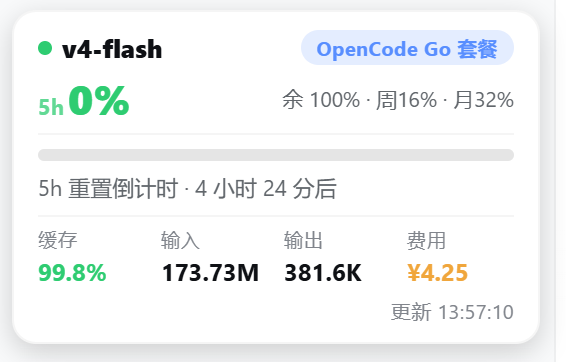
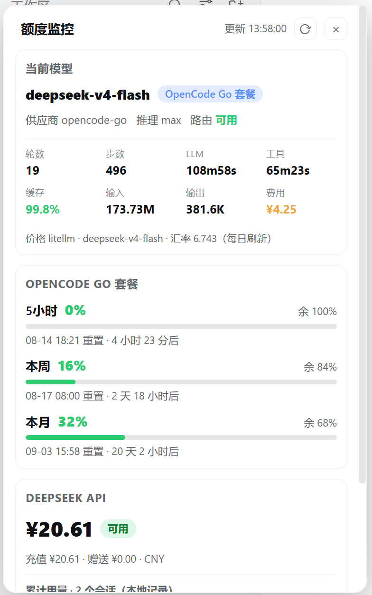

# dsh-quota-monitor

DeepSeek Harness (DSH) Web 插件：界面**左下角**的**额度监控窗口**，实时展示
**OpenCode Go 套餐**（5小时/周/月额度）、**DeepSeek API**（余额/用量）与
**MiniMax Token Plan**（5小时/本周额度），以及当前任务的 token 消耗与预估费用。

> v0.6.0 起：**P0 自建计量**（llm/stream 瀑布记账，不再依赖 `session_projcache.json`）
> + **P1 供应商抽象**（`balance`/`windows` 两类模型 + 预设 + 可配置解析器）+ **bundle 打包**（免手动 loader 行）。

## 截图

| 折叠状态（小药丸） | 展开状态（监控窗口） |
|---|---|
|  |  |

## 功能

- **收起态**：可拖拽的状态条卡片，宽度跟随侧边栏。显示当前模型与套餐标签、
  当前套餐额度/余额（余额金色大字；Go 5h 已用% + 进度条 + 重置倒计时）、
  任务四指标（缓存命中率 · 输入 · 输出 · 预估费用）。
- **展开态**：384px 监控面板（点击空白 / Esc 关闭），展示全部套餐明细：
  当前模型（名称 / 套餐 / 推理 / 路由）、任务指标网格（轮数 / 步数 / 时长 /
  缓存 / 输入 / 输出 / 费用，明细在 tooltip）、OpenCode Go 三窗口
  （5小时 / 本周 / 本月）、DeepSeek 余额与累计用量。
- **实时同步**：与聊天框模型选择同步，切换 DeepSeek ↔ OpenCode Go 的瞬间
  卡片即切换对应套餐视图。
- **费用预估**：按 API 单价 × 用量折算（USD→CNY）；价格与汇率每日自动刷新
  （litellm → openrouter → 内置兜底），DeepSeek 调价次日自动生效。
- **P0 自建计量（v0.6.0）**：所有"本地用量"来自插件自有的
  `$DSH_HOME/storages/dsh-opencode-quota-usage.jsonl` 账本（`llm/stream` 瀑布
  逐次记账，90 天留存）；会话统计（轮数/步骤/时长）仍优先取 DSH 投影缓存，
  缺失时自动回落到自有账本口径，格式变化不报错。
- **P1 供应商抽象（v0.6.0）**：每个被监控目标 = 一条供应商配置（`kind:
  balance|windows`），内置预设 `deepseek-official` / `opencode-go` / `new-api` /
  `sub2api`；解析器支持内置 / 粘贴 JS / 脚本文件三种形态；`/quota-providers`
  暴露全部已配置供应商快照（供未来设置页使用）。
- 60 秒自动轮询 + 聚焦刷新 + 手动刷新；密钥只留在宿主机，不进浏览器。

## 安装（v0.6.0 起为 bundle 型，一条命令）

**前置：已用 `opencode auth login` 登录；DSH 凭据配置了 `DEEPSEEK_API_KEY`。**

```sh
# 本地目录（开发模式）
dsh plugin --profile web add D:\OneDrive\DeepSeek\dsh-quota-monitor
# 或：npm 安装
dsh plugin --profile web add dsh-quota-monitor
# 或：GitHub 源码安装
dsh plugin --profile web add github:mouse33333/dsh-quota-monitor
```

**重启 GUI 应用**使宿主端生效（浏览器端 UI 变更可 HMR 热替换，宿主端路由/价格服务需重启）。

> v0.6.0 起包内自带 `cordis.patch.yml` 补丁层（`dsh.bundle.patch`），loader 行
> 由 bundle 机制自动合并，**不再需要手动编辑 profile 的 cordis.patch.yml**。

## 更新

```sh
npm view dsh-quota-monitor version                    # 查看最新版本
dsh plugin --profile web update dsh-quota-monitor     # 升级
# 生效：UI 刷新页面即可；宿主端变更重启应用
```

## 配置（v0.6.0 新增）

除界面下拉预设外，可通过包条目的 `config` 覆盖/新增供应商（未来设置页将直接写这里）：

```yaml
- id: dsh-quota-monitor
  name: dsh-quota-monitor
  config:
    cacheTtlMs: 5000
    timeoutMs: 15000
    lowBalanceThreshold: 20
    providers:
      # 覆盖内置预设：给 opencode-go 设独立低阈值
      opencode-go:
        lowBalanceThreshold: 10
      # 新增自定义网关（复用通用余额解析器）
      my-gateway:
        label: 自建网关
        kind: balance
        url: https://gw.example.com/v1/balance
        apiKeyEnv: MY_GW_KEY
        parse: { builtin: generic-balance }
        currency: USD
```

- 供应商字段：`kind`（`balance`|`windows`）、`url`、`apiKeyEnv`、`headers`、
  `auth`（`bearer`/`raw`）、`currency`、`parse`（`builtin`/`source`/`file`）、
  `lowBalanceThreshold`。
- 内置解析器：`deepseek-balance`、`opencode-go-usage`、`new-api-self`、
  `sub2api-usage`、`generic-balance`；`parse.source` 支持粘贴 JS 函数，
  `parse.file` 支持脚本文件（默认导出一个 `(raw) => 快照片段` 的函数）。
- OpenCode 令牌：`~/.local/share/opencode/auth.json`（`OPENCODE_QUOTA_AUTH` 可覆盖），
  或环境变量 `OPENCODE_API_KEY`。
- DeepSeek 密钥：DSH 凭据中的 `DEEPSEEK_API_KEY` 或环境变量。
- 价格/汇率：每日刷新一次并缓存 24h；离线回落内置价格表（面板标注"内置价格"）。
- 轮询间隔：60 秒（`lib/client.js` 中 `POLL_INTERVAL_MS`）。

## 安全说明

- 所有 API 密钥只存在于宿主机（credentials 服务 / 环境变量 / opencode auth.json），
  仅作为 Authorization 头发往配置的供应商 URL；错误信息令牌脱敏；
- opencode zen usage 接口无官方文档（逆向接口），上游变更需跟进；
- 用量账本只记录 token 数与会话元数据，**不含任何密钥或消息内容**。

## 开发与发布

- 源码：`lib/index.js`（宿主端，零依赖 Node ESM）+ `lib/client.js`（浏览器端 bundle）。
- 开发记录：[docs/DEVELOPMENT.md](docs/DEVELOPMENT.md) · 变更历史：[CHANGELOG.md](CHANGELOG.md)
- 冒烟测试：`.research/test-refactor-smoke.mjs`（mock ctx + 桩上游，验证全部路由契约与账本）
- npm: <https://www.npmjs.com/package/dsh-quota-monitor> · GitHub: <https://github.com/mouse33333/dsh-quota-monitor>
